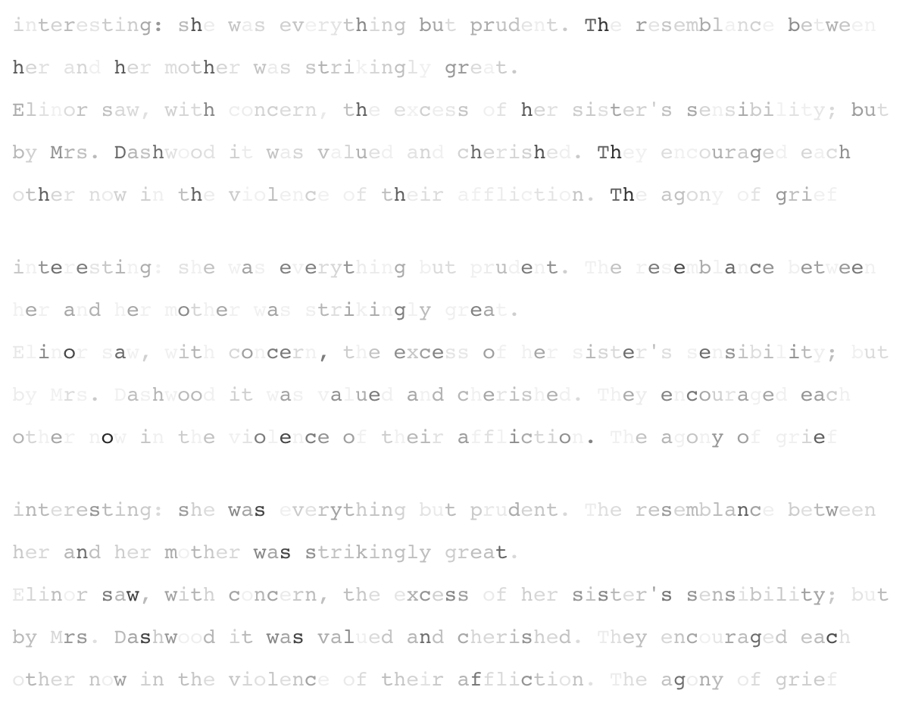

# autoenc-neurons (work in progress)

An experiment with convolutional autoencoders as applied to text, and exploring what the
'neurons' in the convolutional layers respond to.

## Running

Note that if you do not have GPUs, you will need to edit the script to install `tensorflow` 
instead of `tensorflow-gpu`, and change `gpu_count` to 0.

```bash
python3 autoenc-neurons.py
```

This will start model training and then produce output, at last, like this:



The output contains several lines from the text, repeated several times. In each
stanza, the letters are shaded according to the activation that it causes a particular neuron
(darker means more active). This is repeated for several neurons.


## References

The source text is The Complete Project Gutenberg Works of Jane Austen:                       
http://www.gutenberg.org/files/31100/31100.txt

For more on convolutional autoencoders in Keras, see:
https://blog.keras.io/building-autoencoders-in-keras.html